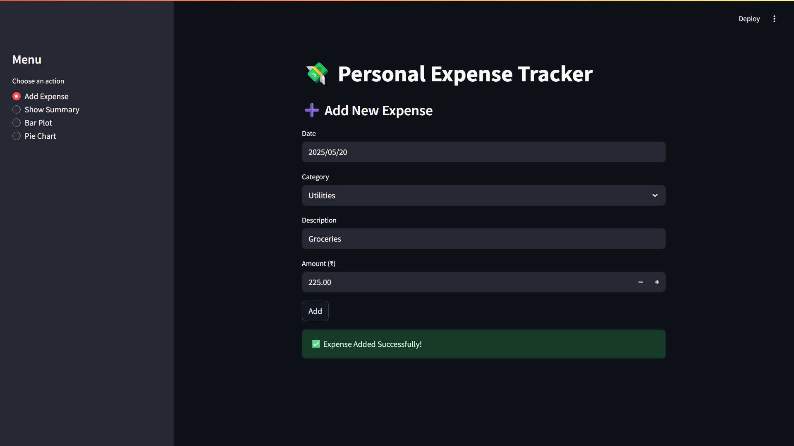
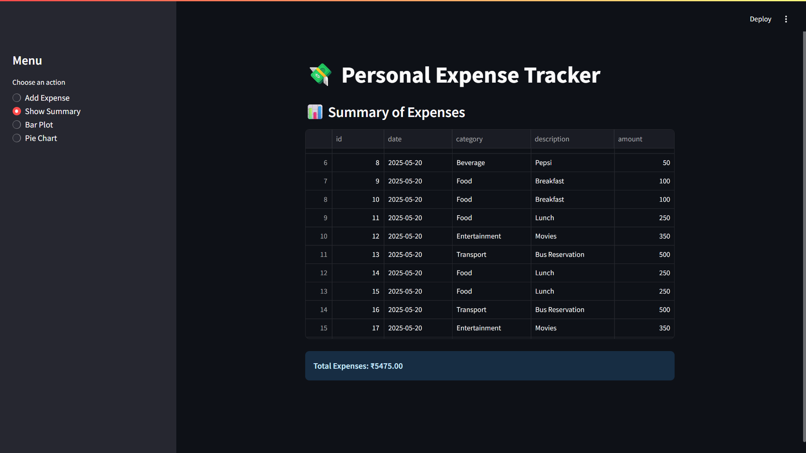
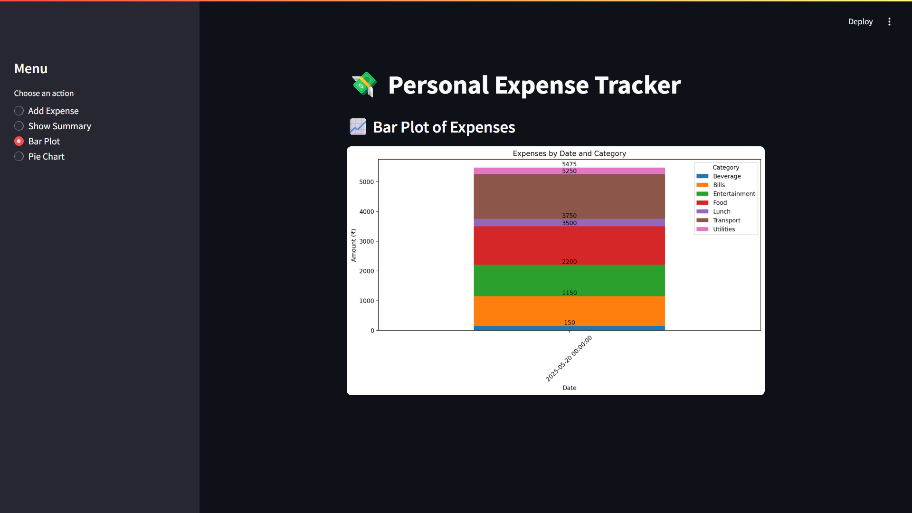
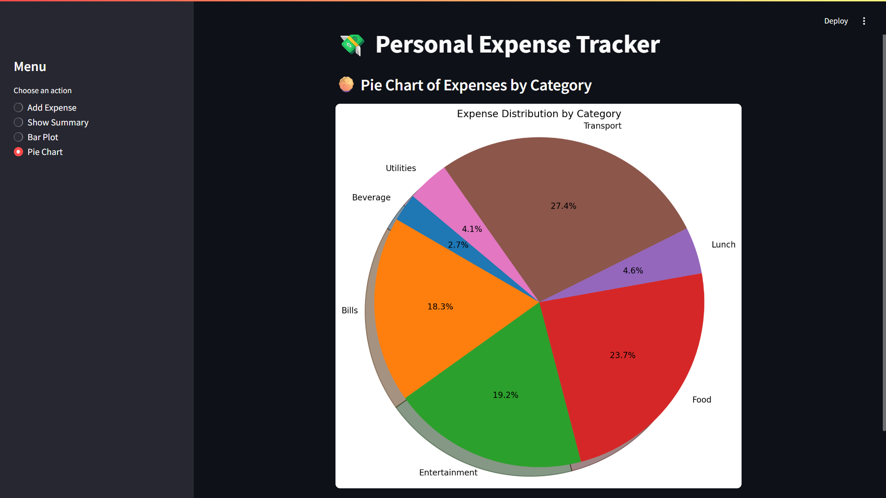

# Personal Expense Tracker

A simple and interactive Personal Expense Tracker built using Python, Pandas, SQLite, and Streamlit.  
Track your daily expenses, categorize them, and visualize your spending habits with bar charts and pie charts.

---

## Features

- Add and categorize expenses with date, description, and amount  
- View summary of total expenses  
- Visualize expenses with bar plots and pie charts by category  
- User-friendly web interface with Streamlit  
- Persistent data storage using SQLite  

---

## Tech Stack

- Python  
- Pandas  
- SQLite  
- Streamlit  
- Matplotlib & Seaborn (for visualizations)  

---

## Screenshots

  
*Home Screen: Add and view expenses*

  
*Summary of total expenses*

  
*Bar chart of expenses by category*

  
*Pie chart visualization of expenses*

---

## Author

**Shashidhar PB**  
- LinkedIn: [https://www.linkedin.com/in/shashidharpb5](https://www.linkedin.com/in/shashidharpb5) (Username: shashidharpb5)  
- GitHub: [https://github.com/Shashidharpb5](https://github.com/Shashidharpb5)  
